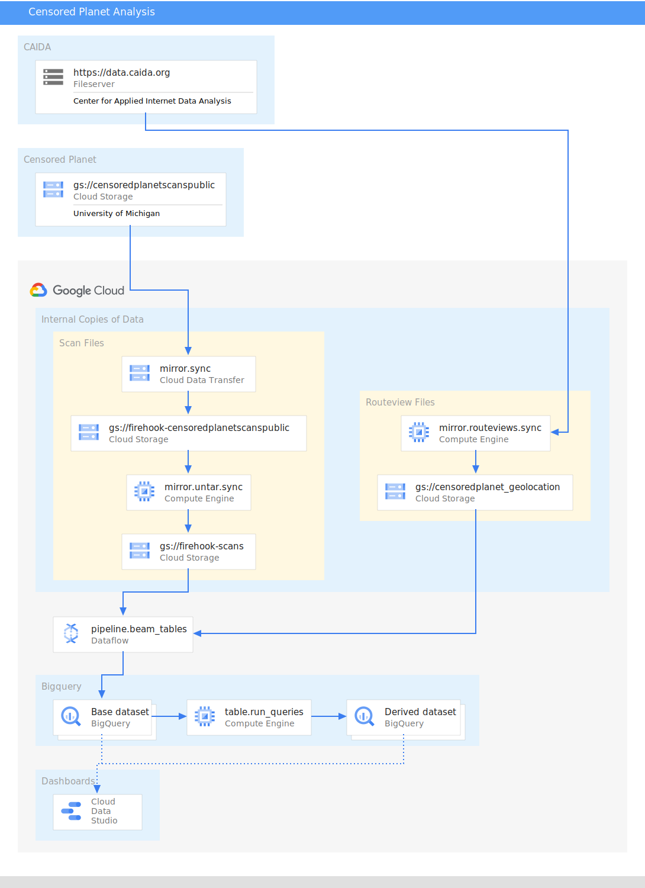

# Censored Planet Data Analysis Pipeline

This pipeline takes raw data from the
[Censored Planet Observatory](https://censoredplanet.org/data/raw) and runs it
through a pipeline to create bigquery tables for easier data analysis.

Because of the size of the data involved (many TB) this project requires a
devoted Google Cloud project to run in. It is not recommended to run yourself,
but the code is made available for anyone who wants to understand how the data
pipeline works.

## System Diagram

## Running as an Automated Pipeline

There are two main top-level pieces

`python -m mirror.data_transfer`

This sets up a daily data transfer job to copy scan files from the Censored
Planet cloud bucket to an internal bucket.

`python -m schedule_pipeline`

This does some additional daily data processing and schedules an daily
incremental Apache Beam pipeline over the data. It expects to be run via a
Docker container on a GCE machine.

`./deploy.sh prod`

Will deploy the main pipeline loop to a GCE machine

## Running Manually

Individual pieces of the pipeline can be run manually.

### Mirroring Data

These scripts pull in a large amount of data from external datasources and
mirror it in the correct locations in google cloud buckets.

`python -m mirror.untar_files.sync`

Decompresses any Censored Planet scan files which have been transfered into the
project but are still compressed. This can also be used as a backfill tool to
decompress missing files.

`python -m mirror.routeviews.sync`

Transfers in the latest missing CAIDA routeview files. (Can only mirror in data
from the last 30 days of data.)

`python -m mirror.routeviews.bulk_download`

Transfers in all CAIDA routeview files from a certain date. This is used for
backfilling data from older than 30 days.

In all cases to fix missing or incorrect data simple delete the incorrect data
from the google cloud bucket and re-run the appropriate script to re-mirror it.

`python -m mirror.internal.sync`

Downloads most recent version of Censored Planet resources locally.

### Processing Data

`python -m pipeline.run_beam_tables --env=prod --full`

Runs the full Apache Beam pipeline. This will re-process all data and rebuild
existing base tables.

`python -m table.run_queries`

Runs queries to recreate any tables derived from the base tables.

## Testing

To run all tests run

`python -m unittest`

To typecheck all files install mypy and run

`mypy ^env**/*.py`

This produces some spurious errors because of missing types in dependencies
