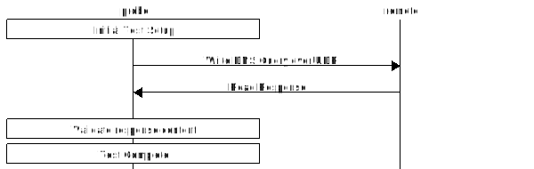

# Reduced Satellite Table

The table `firehook-censoredplanet.derived.merged_reduced_satellite_scans_vN` (where N is a version number)
contains filtered and pre-aggregated data to be used in the Censored Planet dashboard.

This table is evolving and will change in backwards incompatible ways. When a backwards-incompatible
change happens the version number will increment. Older version of the table will be deleted.

The view `firehook-censoredplanet.derived.merged_reduced_satellite_scans` points to the latest version of
the table above. If you would like to deal with backwards-incompatible changes yourself rely on
this view instead of the table directly.

The table is created by the script
[merged_reduced_satellite_scans.sql](../table/queries/merged_reduced_satellite_scans.sql).

## Partitioning and Clustering

The table is [time-partitioned](https://cloud.google.com/bigquery/docs/partitioned-tables) along the `date` field.
This allows queries to skip any data outside the desired date range.

The table also uses [clustering](https://cloud.google.com/bigquery/docs/clustered-tables) to make filtering and aggregation
more efficient. The table is clustered along the `source`, `country_name`, `network` and `domain` columns.
The columns `source` and `country_name` are always used for filtering, so they come first.

## Table Format

Reduced Scans

| Field Name       | Type    | Contains |
| ---------------- | ------- | -------- |
| date             | DATE    | Date that an individual measurement was taken |
| source           | STRING  | What probe type the measurement came from ("SATELLITE") |
| domain           | STRING  | The domain being tested (eg. `example.com`) or `CONTROL` for control measurements |
| category         | STRING  | The [category](domain_categories.md) of the domain being tested, eg. `Social Networking`, `None` if unknown |
| country_name     | STRING  | The country of the autonomous system, eg. `United States`  |
| network          | STRING  | The Autonomous System long name, eg. `China Telecom` |
| subnetwork       | STRING  | The combination of the AS number and the IP organization. The subnetworks can represent multiple autonomous systems owned by a single organization. They can also show IP space which has been sub-leased from one organization to another. e.g. `AS4812 - Apple technology services (Shanghai) Co., Ltd.` which represents IP space sub-leased from `China Telecom`'s network `AS4812` |
| outcome          | STRING  | An outcome classification, explained below. eg `read/timeout` |
| count            | INTEGER | How many measurements fit the exact pattern of this row? |
| unexpected_count | INTEGER | Count of measurements with an unexpected outcome |

## Outcome Classification

The `outcome` field classifies the result of a test into an enumeration of the different types of high-level outcomes. Outcome strings are of the format `stage/outcome`. For example `read/udp.timeout` means the test timed out during the read stage. `expected/match` means a test finished successfully.

### Stages

Stages are listed here in order. If a test reaches a later stage like `dns` then it successfully passed the earlier stages like `setup` and `read`.

| Stage       | Explanation |
| ----------- | ----------- |
| setup       | The initial setup phase for the test (mustering resources, opening ports, etc.) |
| write       | Writing to the remote. This is where the query is sent |
| read        | Reading from the remote |
| dns         | Verification of the DNS response (rcode and answer IPs) |
| expected    | Verified an expected response |
| unknown     | Unknown stage. Usually these are new outcomes which should be investigated and classified |

#### Stages per Probe

Here are the stages for Satellite.

### Outcome Classes

Basic outcomes represent simplest types of errors, as well as the `match` case (no error detected).

Protocol errors are similar but not identical to the Network Error Logging standard's [Predefined Network Error Types](https://www.w3.org/TR/network-error-logging/#predefined-network-error-types). The DNS rcodes are defined by IANA [here](https://www.iana.org/assignments/dns-parameters/dns-parameters.xhtml). These errors (e.g. NXDOMAIN) may represent normal network failures and noise, but they may also expose interference.

Mismatch Errors are used when the connection is successful, but the content received does not match the content expected. This can happen in the case of blockpages, remote servers with unusual behavior, or complicated CDN networks serving many sites.

| Outcome Class           | Explanation |
| ----------------------- | ----------- |
|                         |
| **Basic Outcomes**      |
|                         |
| match                   | The test completed successfully and no interference was detected |
| controls                | The control measurements failed, rendering the test invalid |
| unknown                 | The class of the outcome was not known. Usually these are new errors which should be investigated and classified |
|                         |
| **Protocol Errors**     | There were errors in the connection protocol |
|                         |
| ip.host_no_route        | No route to the host could be found |
| udp.timeout             | The UDP "connection" timed out |
| udp.refused             | The UDP "connection" was refused. Possibly due to misconfiguration |
| dns.msgsize             | The DNS message size is invalid |
| dns.name_not_resolved   | The resolver responded but was unable to resolve the address |
| dns.formerr             | rcode 1: Format Error |
| dns.servfail            | rcode 2: Server Failure |
| dns.nxdomain            | rcode 3: Non-Existent Domain |
| dns.notimp              | rcode 4: Not Implemented |
| dns.refused             | rcode 5: Query Refused |
| dns.yxdomain            | rcode 6: Name Exists when it should not |
| dns.yxrrset             | rcode 7: RR Set Exists when it should not |
| dns.nxrrset             | rcode 8: RR Set that should exist does not |
| dns.notauth             | rcode 9: Server Not Authoritative for zone / Not Authorized |
| dns.notzone             | rcode 10: Name not contained in zone |
| dns.badsig              | rcode 16: TSIG Signature Failure |
| dns.badkey              | rcode 17: Key not recognized |
| dns.badtime             | rcode 18: Signature out of time window |
| dns.badmode             | rcode 19: Bad TKEY Mode |
| dns.badname             | rcode 20: Duplicate key name |
| dns.badalg              | rcode 21: Algorithm not supported |
| dns.badtrunc            | rcode 22: Bad truncation |
| dns.badcookie           | rcode 23: Bad/missing Server Cookie |
|                         |
| **Mismatched Content**  | The connection completed successfully, but the content returned didn't match the content expected for the domain. |
|                         |
| dns.ipmismatch          | The query's answer IPs and tags (ASN, TLS certificate hash, HTTP hash) did not overlap with the answer IPs and tags from the control resolvers |

