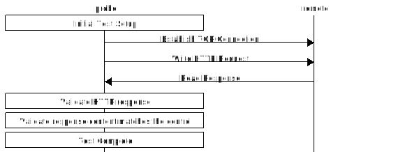
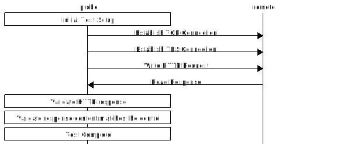

# Reduced Table

This table is actually a view joining two tables, in order to read over less
data with every request.

These tables are created by the script
[merged_reduced_scans.sql](../table/queries/merged_reduced_scans.sql).

## Table names

### View

- firehook-censoredplanet.derived.merged_reduced_scans

### Sub-tables

- `firehook-censoredplanet.derived.merged_reduced_scans_no_as`
- `firehook-censoredplanet.derived.merged_net_as`

These two tables are joined on their `date` and `netblock` fields to create the
view.

## Partitioning and Clustering

The sub-tables are time-partitioned along the `date` field.

`firehook-censoredplanet.merged_reduced_scans` is clustered along the `netblock`
field.

`firehook-censoredplanet.merged_net_as` is clustered along the `country`,
`domains` and then `netblock` fields.

## Table Format

Reduced Scans

| Field Name | Type    | Contains |
| ---------- | ------- | -------- |
| date       | DATE    | Date that an individual measurement was taken |
| domain     | STRING  | The domain being tested, eg. `example.com` |
| country    | STRING  | Autonomous system country, eg. `US`  |
| netblock   | STRING  | Netblock of the IP, eg. `1.1.1.0/24`  |
| asn        | INTEGER | Autonomous system number, eg. `13335` |
| as_name    | STRING  | Autonomous system long name, eg. `Cloudflare, Inc.` |
| result     | STRING  | `null` (meaning success) or error returned. eg. `Incorrect web response: status lines don't match`. Errors come either from the probe system, or directly from [Go's net package](https://golang.org/pkg/net/) |
| outcome    | STRING  | An outcome classification, explained below. eg `read/timeout` |
| count      | INTEGER | How many measurements fit the exact pattern of this row? |

## Outcome Classification

The `outcome` field classifies the result of a test into an enumeration of the different types of high-level outcomes. Outcome strings are of the format `stage/outcome`. For example `read/timeout` means the test received a TCP timeout during the read stage. `complete/success` means a test finished successfully.

### Stages

Stages are listed here in order. If a test reaches a later stage like `content` then it successfully passed the earlier stages like `dial` and `read`.

| Stage       | Explanation |
| ----------- | ----------- |
| setup       | The initial setup phase for the test (mustering resources, opening ports, etc.) |
| dial        | The initial TCP dial connection to the remote |
| tls         | The TLS handshake. `HTTPS` only. The [SNI header](https://en.wikipedia.org/wiki/Server_Name_Indication) containing the test domain is sent in this stage |
| write       | Writing to the remote. For non-`HTTPS` tests this is where the domain is sent |
| read        | Reading from the remote |
| http        | Verification of HTTP headers. `HTTP/S` only |
| content     | Verification that the returned content matches the expected content. These are the most common types of errors and represent things like blockpages |
| complete    | Reaching the final stage without encountering any problems in the previous stages |
| unknown     | Unknown stage. Usually these are new outcomes which should be investigated and classified |

#### Stages per Probe

Not all tests include every stage depending on the type of test. For example since the Echo protocol does not involve TLS Echo tests will never fail with outcomes classified as `tls`. Here are the stages for each test type.

##### Discard

##### Echo

##### HTTP

##### HTTPS

### Outcome Classes

Basic outcomes represent simplest types of errors, as well as the `success` case (no error detected).

Protocol errors are similar but not identical to the Network Error Logging standard's [Predefined Network Error Types](https://www.w3.org/TR/network-error-logging/#predefined-network-error-types). These errors may represent normal network failures and noise, but they may also expose interference by a middlebox to disrupt a connection. For example China and Iran are both known to use [TCP Reset Attacks](https://en.wikipedia.org/wiki/TCP_reset_attack) as a censorship method.

Mismatch Errors are used when the connection is successful, but the content received does not match the content expected. This can happen in the case of blockpages, remote servers with unusual behavior, or complicated CDN networks serving many sites.

| Outcome Class           | Explanation |
| ----------------------- | ----------- |
|                         |
| **Basic Outcomes**      |
|                         |
| success                 | The test completed successfully and no interference was detected |
| system_failure          | There was a test system failure, rendering the test invalid |
| unknown                 | The class of the outcome was not known. Usually these are new errors which should be investigated and classified |
|                         |
| **Protocol Errors**     | There were errors in the connection protocol |
|                         |
| ip.network_unreachable  | The network was unreachable |
| ip.host_no_route        | No route to the host could be found |
| timeout                 | The connection timed out. Could indicate packets being dropped by a middlebox |
| tcp.refused             | The TCP connection was refused by the server |
| tcp.reset               | The TCP connection was reset. Could indicate an inserted `RST` packet |
| tls.failed              | The TLS connection failed, usually due to a TLS protocol error |
| http.invalid            | The HTTP response could not be parsed. Possibly because the response has a content-length mismatch, has improper encoding, or other conditions |
| http.empty              | Received no content when HTTP content was expected |
| http.truncated_response | The HTTP response content was unexpectedly truncated |
|                         |
| **Mismatch Errors**     | The connection completed successfully, but the content returned didn't match the content expected for the domain. |
|                         |
| response_mismatch       | Received a different response from the one expected.   For Discard no response is expected and any response is a mismatch,   for Echo a mirrored response is expected and anything else is a mismatch. |
| status_mismatch         | The HTTP status code didn't match, eg. `403` instead of `200` |
| body_mismatch           | The HTTP body didn't match, potentially a blockpage |
| tls_mismatch            | An element of the TLS connection (certificate, cipher suite, or TLS version) didn't match |
